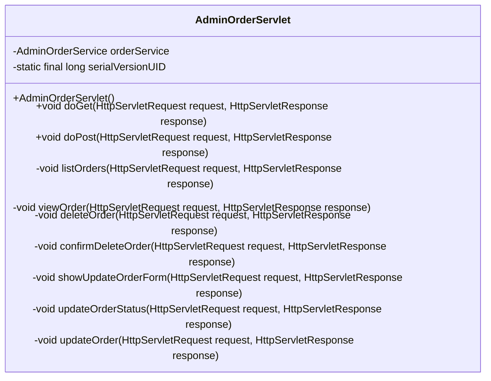

```mermaid
classDiagram
    class AdminOrderServlet {
        -AdminOrderService orderService
        -static final long serialVersionUID
        
        +AdminOrderServlet()
        +void doGet(HttpServletRequest request, HttpServletResponse response)
        +void doPost(HttpServletRequest request, HttpServletResponse response)
        -void listOrders(HttpServletRequest request, HttpServletResponse response)
        -void viewOrder(HttpServletRequest request, HttpServletResponse response)
        -void deleteOrder(HttpServletRequest request, HttpServletResponse response)
        -void confirmDeleteOrder(HttpServletRequest request, HttpServletResponse response)
        -void showUpdateOrderForm(HttpServletRequest request, HttpServletResponse response)
        -void updateOrderStatus(HttpServletRequest request, HttpServletResponse response)
        -void updateOrder(HttpServletRequest request, HttpServletResponse response)
    }
```
