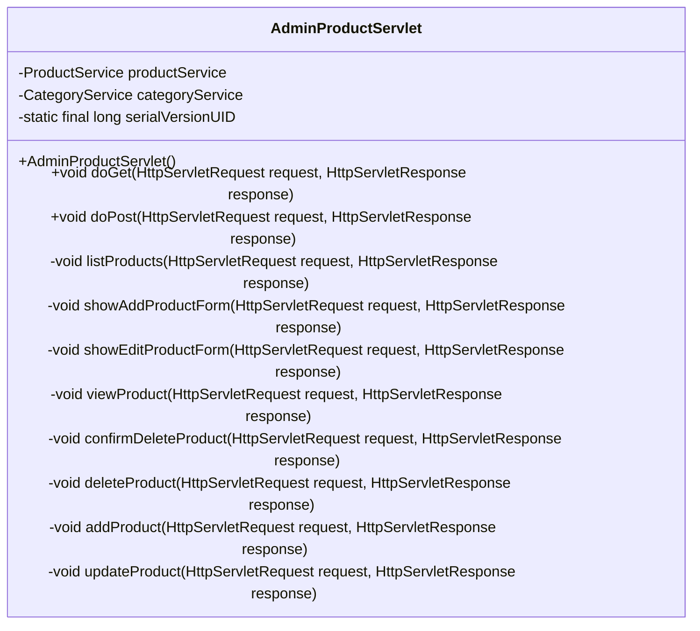

```mermaid
classDiagram
    class AdminProductServlet {
        -ProductService productService
        -CategoryService categoryService
        -static final long serialVersionUID
        
        +AdminProductServlet()
        +void doGet(HttpServletRequest request, HttpServletResponse response)
        +void doPost(HttpServletRequest request, HttpServletResponse response)
        -void listProducts(HttpServletRequest request, HttpServletResponse response)
        -void showAddProductForm(HttpServletRequest request, HttpServletResponse response)
        -void showEditProductForm(HttpServletRequest request, HttpServletResponse response)
        -void viewProduct(HttpServletRequest request, HttpServletResponse response)
        -void confirmDeleteProduct(HttpServletRequest request, HttpServletResponse response)
        -void deleteProduct(HttpServletRequest request, HttpServletResponse response)
        -void addProduct(HttpServletRequest request, HttpServletResponse response)
        -void updateProduct(HttpServletRequest request, HttpServletResponse response)
    }
```
