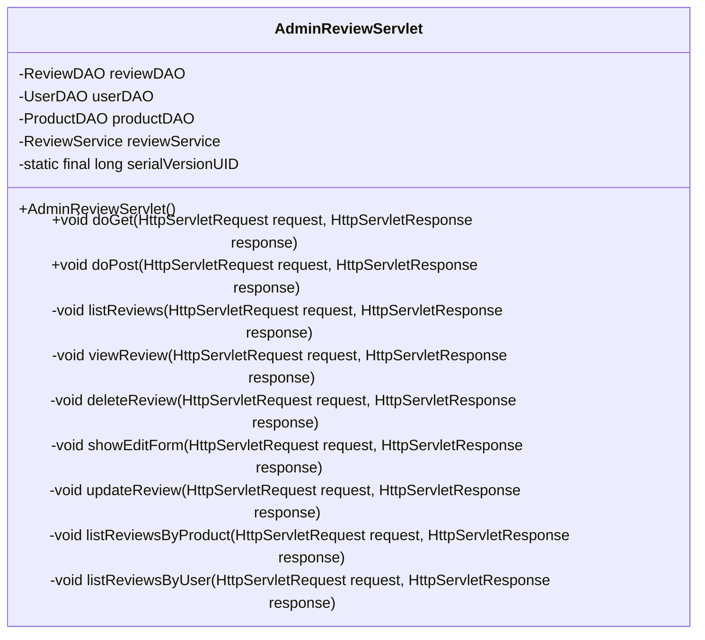

```mermaid
classDiagram
    class AdminReviewServlet {
        -ReviewDAO reviewDAO
        -UserDAO userDAO
        -ProductDAO productDAO
        -ReviewService reviewService
        -static final long serialVersionUID
        
        +AdminReviewServlet()
        +void doGet(HttpServletRequest request, HttpServletResponse response)
        +void doPost(HttpServletRequest request, HttpServletResponse response)
        -void listReviews(HttpServletRequest request, HttpServletResponse response)
        -void viewReview(HttpServletRequest request, HttpServletResponse response)
        -void deleteReview(HttpServletRequest request, HttpServletResponse response)
        -void showEditForm(HttpServletRequest request, HttpServletResponse response)
        -void updateReview(HttpServletRequest request, HttpServletResponse response)
        -void listReviewsByProduct(HttpServletRequest request, HttpServletResponse response)
        -void listReviewsByUser(HttpServletRequest request, HttpServletResponse response)
    }
```
