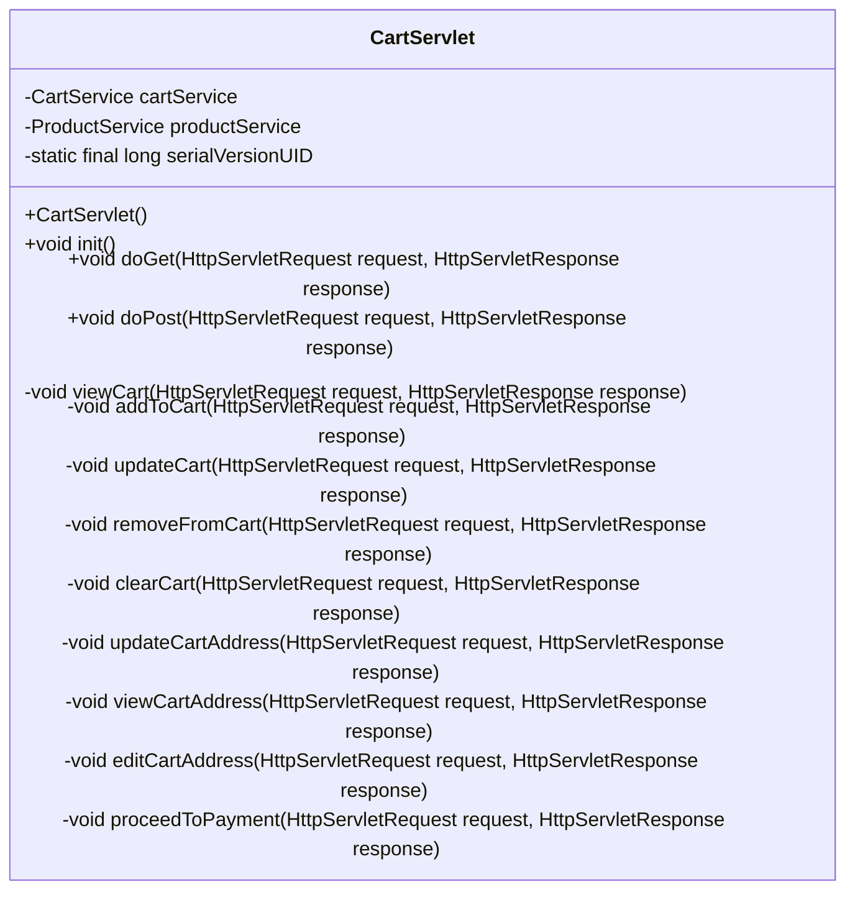

```mermaid
classDiagram
    class CartServlet {
        -CartService cartService
        -ProductService productService
        -static final long serialVersionUID
        
        +CartServlet()
        +void init()
        +void doGet(HttpServletRequest request, HttpServletResponse response)
        +void doPost(HttpServletRequest request, HttpServletResponse response)
        -void viewCart(HttpServletRequest request, HttpServletResponse response)
        -void addToCart(HttpServletRequest request, HttpServletResponse response)
        -void updateCart(HttpServletRequest request, HttpServletResponse response)
        -void removeFromCart(HttpServletRequest request, HttpServletResponse response)
        -void clearCart(HttpServletRequest request, HttpServletResponse response)
        -void updateCartAddress(HttpServletRequest request, HttpServletResponse response)
        -void viewCartAddress(HttpServletRequest request, HttpServletResponse response)
        -void editCartAddress(HttpServletRequest request, HttpServletResponse response)
        -void proceedToPayment(HttpServletRequest request, HttpServletResponse response)
    }
```
