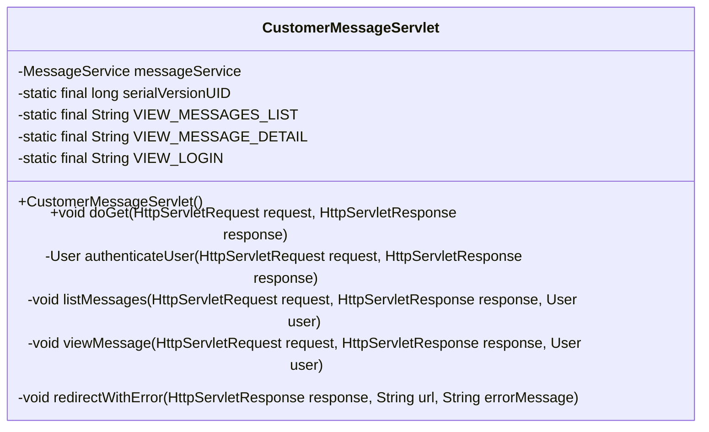

```mermaid
classDiagram
    class CustomerMessageServlet {
        -MessageService messageService
        -static final long serialVersionUID
        -static final String VIEW_MESSAGES_LIST
        -static final String VIEW_MESSAGE_DETAIL
        -static final String VIEW_LOGIN
        
        +CustomerMessageServlet()
        +void doGet(HttpServletRequest request, HttpServletResponse response)
        -User authenticateUser(HttpServletRequest request, HttpServletResponse response)
        -void listMessages(HttpServletRequest request, HttpServletResponse response, User user)
        -void viewMessage(HttpServletRequest request, HttpServletResponse response, User user)
        -void redirectWithError(HttpServletResponse response, String url, String errorMessage)
    }
```
