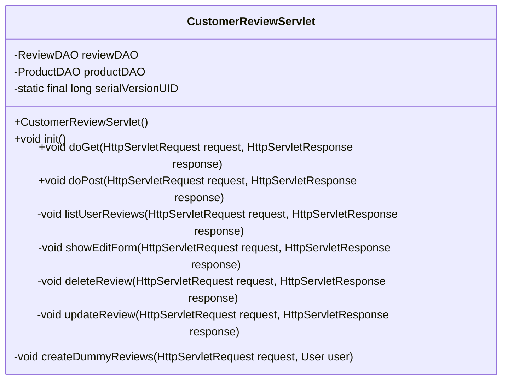

```mermaid
classDiagram
    class CustomerReviewServlet {
        -ReviewDAO reviewDAO
        -ProductDAO productDAO
        -static final long serialVersionUID
        
        +CustomerReviewServlet()
        +void init()
        +void doGet(HttpServletRequest request, HttpServletResponse response)
        +void doPost(HttpServletRequest request, HttpServletResponse response)
        -void listUserReviews(HttpServletRequest request, HttpServletResponse response)
        -void showEditForm(HttpServletRequest request, HttpServletResponse response)
        -void deleteReview(HttpServletRequest request, HttpServletResponse response)
        -void updateReview(HttpServletRequest request, HttpServletResponse response)
        -void createDummyReviews(HttpServletRequest request, User user)
    }
```
