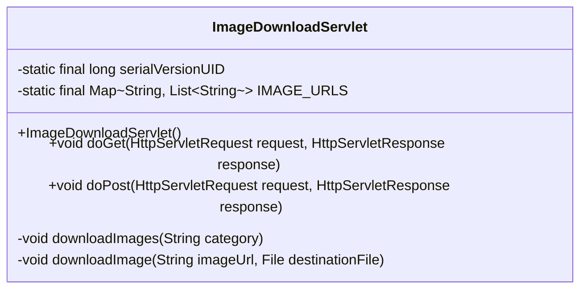

```mermaid
classDiagram
    class ImageDownloadServlet {
        -static final long serialVersionUID
        -static final Map~String, List~String~~ IMAGE_URLS
        
        +ImageDownloadServlet()
        +void doGet(HttpServletRequest request, HttpServletResponse response)
        +void doPost(HttpServletRequest request, HttpServletResponse response)
        -void downloadImages(String category)
        -void downloadImage(String imageUrl, File destinationFile)
    }
```
