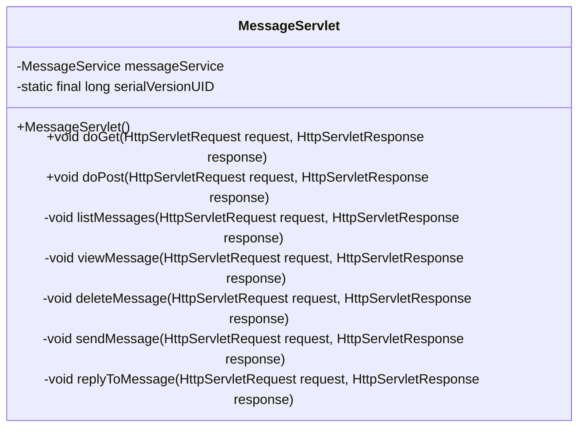

```mermaid
classDiagram
    class MessageServlet {
        -MessageService messageService
        -static final long serialVersionUID
        
        +MessageServlet()
        +void doGet(HttpServletRequest request, HttpServletResponse response)
        +void doPost(HttpServletRequest request, HttpServletResponse response)
        -void listMessages(HttpServletRequest request, HttpServletResponse response)
        -void viewMessage(HttpServletRequest request, HttpServletResponse response)
        -void deleteMessage(HttpServletRequest request, HttpServletResponse response)
        -void sendMessage(HttpServletRequest request, HttpServletResponse response)
        -void replyToMessage(HttpServletRequest request, HttpServletResponse response)
    }
```
