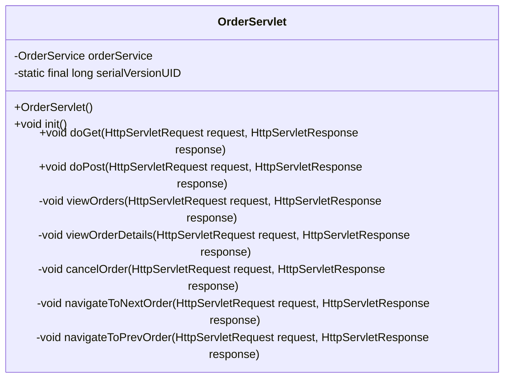

```mermaid
classDiagram
    class OrderServlet {
        -OrderService orderService
        -static final long serialVersionUID
        
        +OrderServlet()
        +void init()
        +void doGet(HttpServletRequest request, HttpServletResponse response)
        +void doPost(HttpServletRequest request, HttpServletResponse response)
        -void viewOrders(HttpServletRequest request, HttpServletResponse response)
        -void viewOrderDetails(HttpServletRequest request, HttpServletResponse response)
        -void cancelOrder(HttpServletRequest request, HttpServletResponse response)
        -void navigateToNextOrder(HttpServletRequest request, HttpServletResponse response)
        -void navigateToPrevOrder(HttpServletRequest request, HttpServletResponse response)
    }
```
