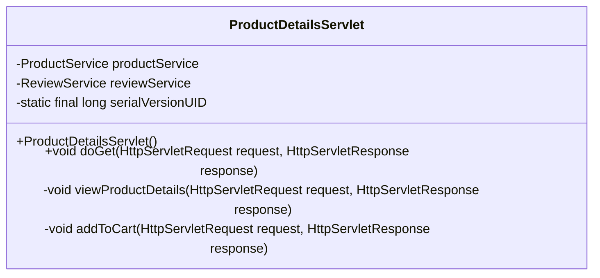

```mermaid
classDiagram
    class ProductDetailsServlet {
        -ProductService productService
        -ReviewService reviewService
        -static final long serialVersionUID
        
        +ProductDetailsServlet()
        +void doGet(HttpServletRequest request, HttpServletResponse response)
        -void viewProductDetails(HttpServletRequest request, HttpServletResponse response)
        -void addToCart(HttpServletRequest request, HttpServletResponse response)
    }
```
