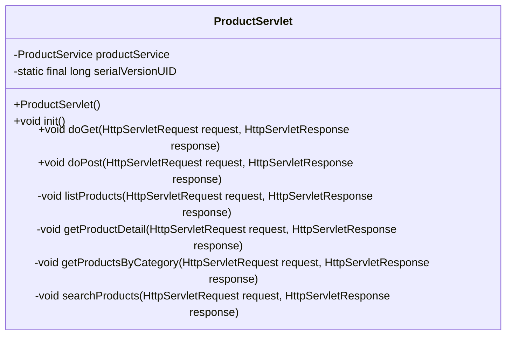

```mermaid
classDiagram
    class ProductServlet {
        -ProductService productService
        -static final long serialVersionUID
        
        +ProductServlet()
        +void init()
        +void doGet(HttpServletRequest request, HttpServletResponse response)
        +void doPost(HttpServletRequest request, HttpServletResponse response)
        -void listProducts(HttpServletRequest request, HttpServletResponse response)
        -void getProductDetail(HttpServletRequest request, HttpServletResponse response)
        -void getProductsByCategory(HttpServletRequest request, HttpServletResponse response)
        -void searchProducts(HttpServletRequest request, HttpServletResponse response)
    }
```
