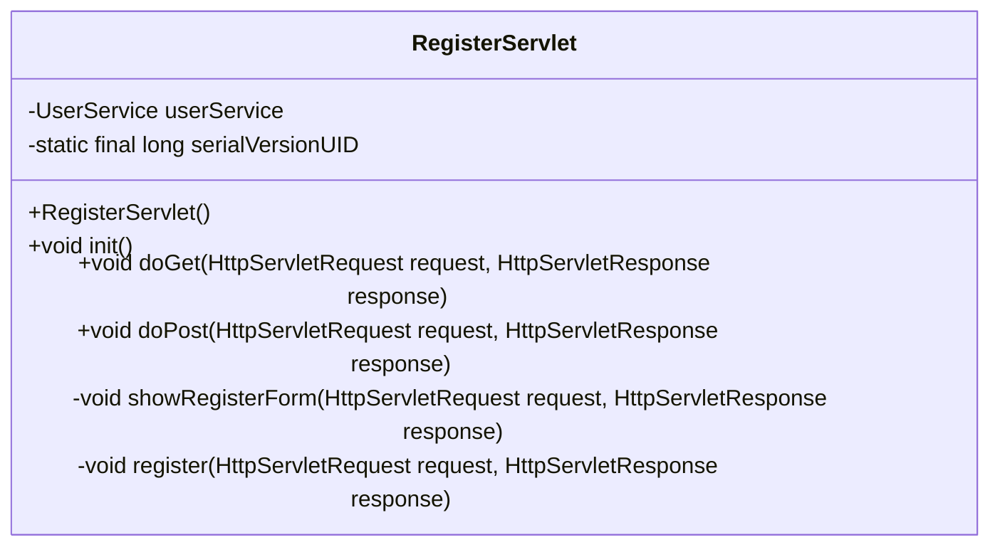

```mermaid
classDiagram
    class RegisterServlet {
        -UserService userService
        -static final long serialVersionUID
        
        +RegisterServlet()
        +void init()
        +void doGet(HttpServletRequest request, HttpServletResponse response)
        +void doPost(HttpServletRequest request, HttpServletResponse response)
        -void showRegisterForm(HttpServletRequest request, HttpServletResponse response)
        -void register(HttpServletRequest request, HttpServletResponse response)
    }
```
