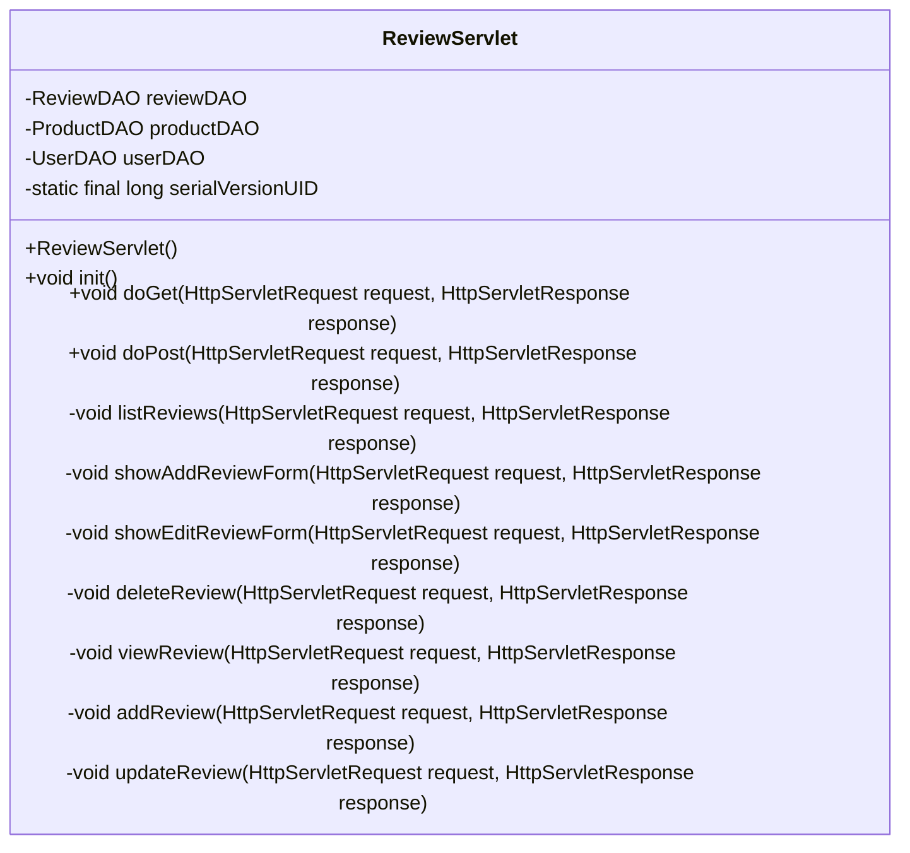

```mermaid
classDiagram
    class ReviewServlet {
        -ReviewDAO reviewDAO
        -ProductDAO productDAO
        -UserDAO userDAO
        -static final long serialVersionUID
        
        +ReviewServlet()
        +void init()
        +void doGet(HttpServletRequest request, HttpServletResponse response)
        +void doPost(HttpServletRequest request, HttpServletResponse response)
        -void listReviews(HttpServletRequest request, HttpServletResponse response)
        -void showAddReviewForm(HttpServletRequest request, HttpServletResponse response)
        -void showEditReviewForm(HttpServletRequest request, HttpServletResponse response)
        -void deleteReview(HttpServletRequest request, HttpServletResponse response)
        -void viewReview(HttpServletRequest request, HttpServletResponse response)
        -void addReview(HttpServletRequest request, HttpServletResponse response)
        -void updateReview(HttpServletRequest request, HttpServletResponse response)
    }
```
