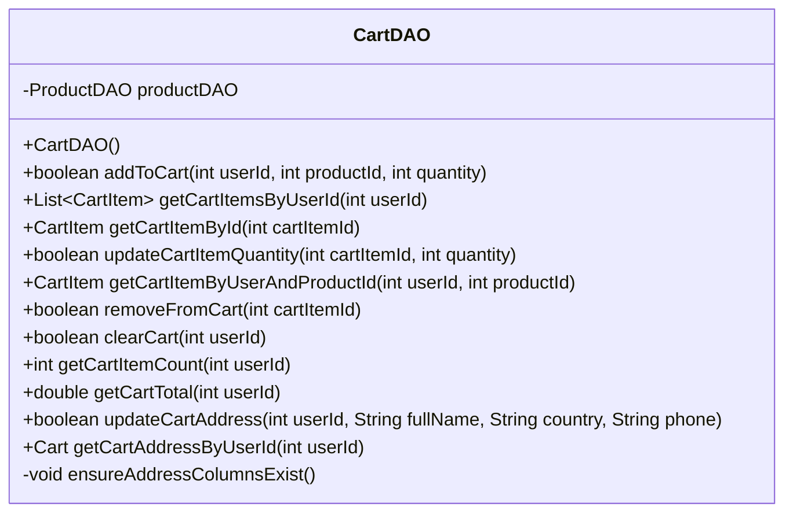

```mermaid
classDiagram
    class CartDAO {
        -ProductDAO productDAO

        +CartDAO()
        +boolean addToCart(int userId, int productId, int quantity)
        +List~CartItem~ getCartItemsByUserId(int userId)
        +CartItem getCartItemById(int cartItemId)
        +boolean updateCartItemQuantity(int cartItemId, int quantity)
        +CartItem getCartItemByUserAndProductId(int userId, int productId)
        +boolean removeFromCart(int cartItemId)
        +boolean clearCart(int userId)
        +int getCartItemCount(int userId)
        +double getCartTotal(int userId)
        +boolean updateCartAddress(int userId, String fullName, String country, String phone)
        +Cart getCartAddressByUserId(int userId)
        -void ensureAddressColumnsExist()
    }
```
