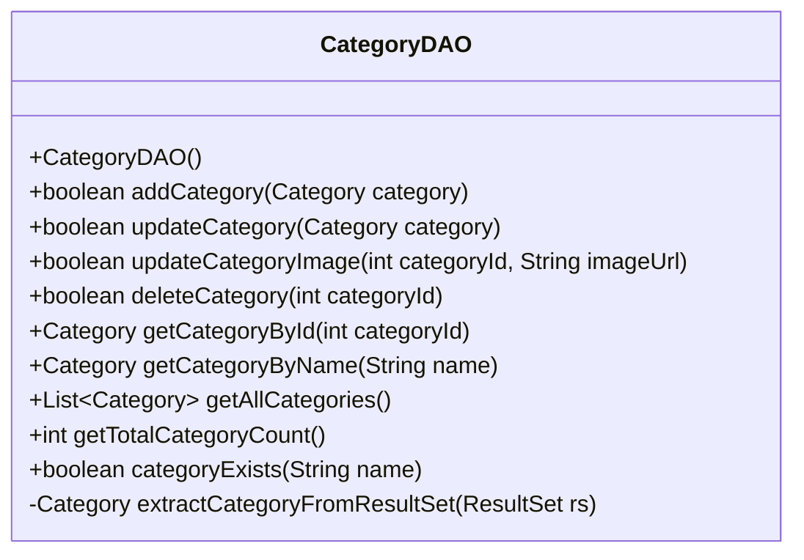

```mermaid
classDiagram
    class CategoryDAO {
        +CategoryDAO()
        +boolean addCategory(Category category)
        +boolean updateCategory(Category category)
        +boolean updateCategoryImage(int categoryId, String imageUrl)
        +boolean deleteCategory(int categoryId)
        +Category getCategoryById(int categoryId)
        +Category getCategoryByName(String name)
        +List~Category~ getAllCategories()
        +int getTotalCategoryCount()
        +boolean categoryExists(String name)
        -Category extractCategoryFromResultSet(ResultSet rs)
    }
```
