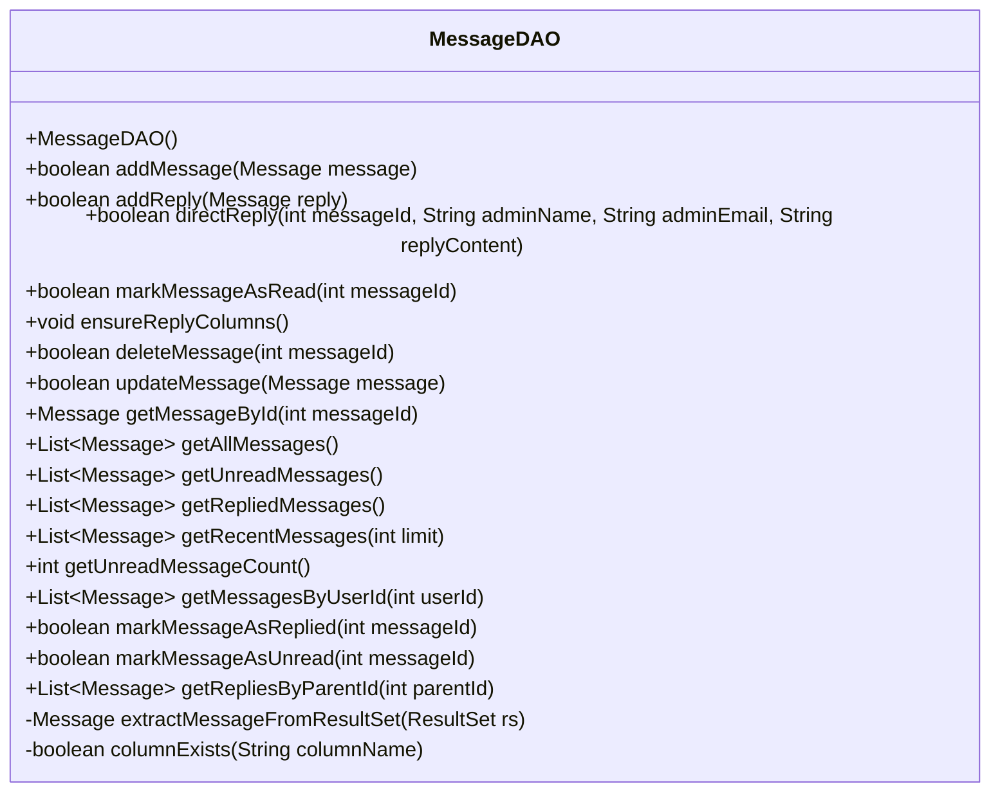

```mermaid
classDiagram
    class MessageDAO {
        +MessageDAO()
        +boolean addMessage(Message message)
        +boolean addReply(Message reply)
        +boolean directReply(int messageId, String adminName, String adminEmail, String replyContent)
        +boolean markMessageAsRead(int messageId)
        +void ensureReplyColumns()
        +boolean deleteMessage(int messageId)
        +boolean updateMessage(Message message)
        +Message getMessageById(int messageId)
        +List~Message~ getAllMessages()
        +List~Message~ getUnreadMessages()
        +List~Message~ getRepliedMessages()
        +List~Message~ getRecentMessages(int limit)
        +int getUnreadMessageCount()
        +List~Message~ getMessagesByUserId(int userId)
        +boolean markMessageAsReplied(int messageId)
        +boolean markMessageAsUnread(int messageId)
        +List~Message~ getRepliesByParentId(int parentId)
        -Message extractMessageFromResultSet(ResultSet rs)
        -boolean columnExists(String columnName)
    }
```
