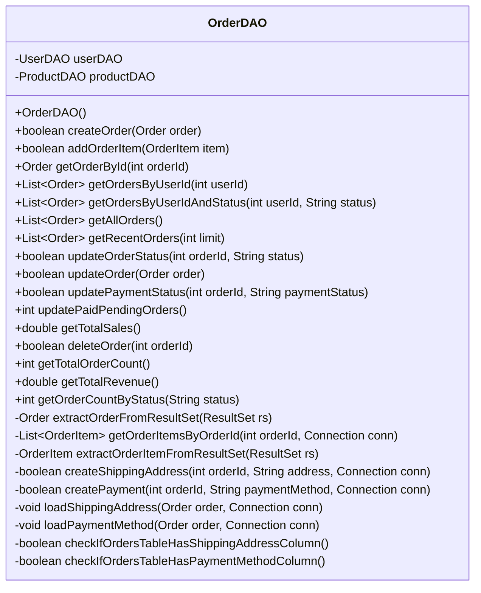

```mermaid
classDiagram
    class OrderDAO {
        -UserDAO userDAO
        -ProductDAO productDAO
        
        +OrderDAO()
        +boolean createOrder(Order order)
        +boolean addOrderItem(OrderItem item)
        +Order getOrderById(int orderId)
        +List~Order~ getOrdersByUserId(int userId)
        +List~Order~ getOrdersByUserIdAndStatus(int userId, String status)
        +List~Order~ getAllOrders()
        +List~Order~ getRecentOrders(int limit)
        +boolean updateOrderStatus(int orderId, String status)
        +boolean updateOrder(Order order)
        +boolean updatePaymentStatus(int orderId, String paymentStatus)
        +int updatePaidPendingOrders()
        +double getTotalSales()
        +boolean deleteOrder(int orderId)
        +int getTotalOrderCount()
        +double getTotalRevenue()
        +int getOrderCountByStatus(String status)
        -Order extractOrderFromResultSet(ResultSet rs)
        -List~OrderItem~ getOrderItemsByOrderId(int orderId, Connection conn)
        -OrderItem extractOrderItemFromResultSet(ResultSet rs)
        -boolean createShippingAddress(int orderId, String address, Connection conn)
        -boolean createPayment(int orderId, String paymentMethod, Connection conn)
        -void loadShippingAddress(Order order, Connection conn)
        -void loadPaymentMethod(Order order, Connection conn)
        -boolean checkIfOrdersTableHasShippingAddressColumn()
        -boolean checkIfOrdersTableHasPaymentMethodColumn()
    }
```
