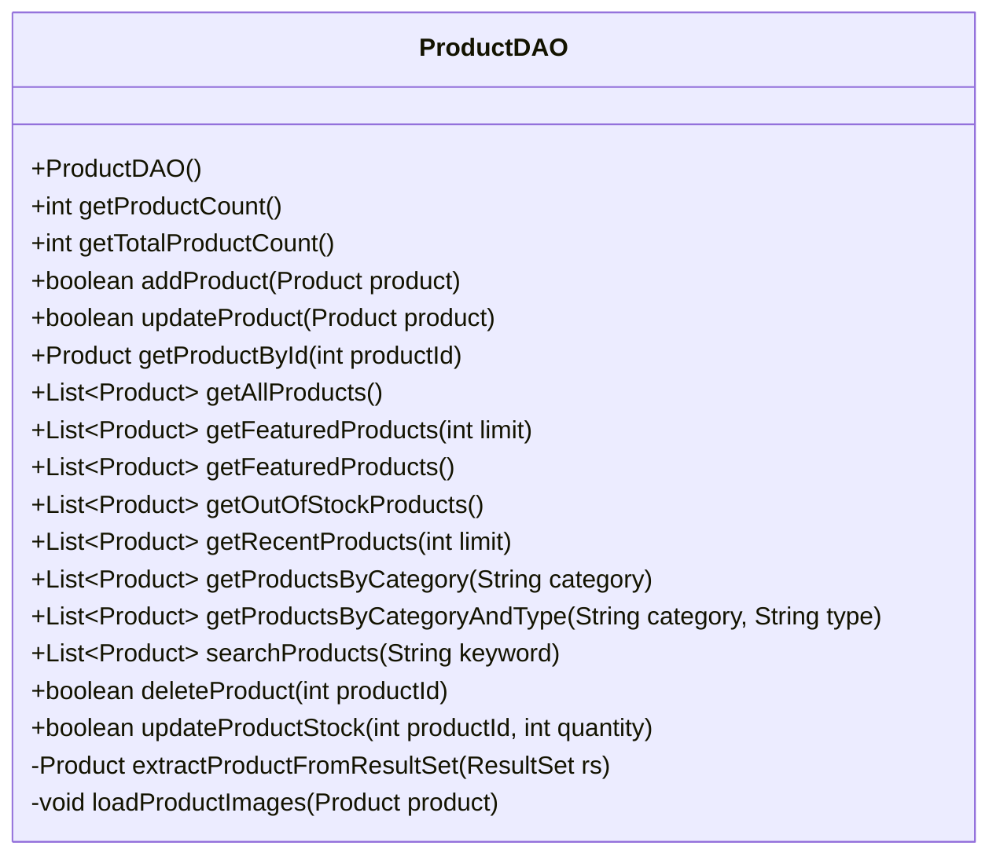

```mermaid
classDiagram
    class ProductDAO {
        +ProductDAO()
        +int getProductCount()
        +int getTotalProductCount()
        +boolean addProduct(Product product)
        +boolean updateProduct(Product product)
        +Product getProductById(int productId)
        +List~Product~ getAllProducts()
        +List~Product~ getFeaturedProducts(int limit)
        +List~Product~ getFeaturedProducts()
        +List~Product~ getOutOfStockProducts()
        +List~Product~ getRecentProducts(int limit)
        +List~Product~ getProductsByCategory(String category)
        +List~Product~ getProductsByCategoryAndType(String category, String type)
        +List~Product~ searchProducts(String keyword)
        +boolean deleteProduct(int productId)
        +boolean updateProductStock(int productId, int quantity)
        -Product extractProductFromResultSet(ResultSet rs)
        -void loadProductImages(Product product)
    }
```
