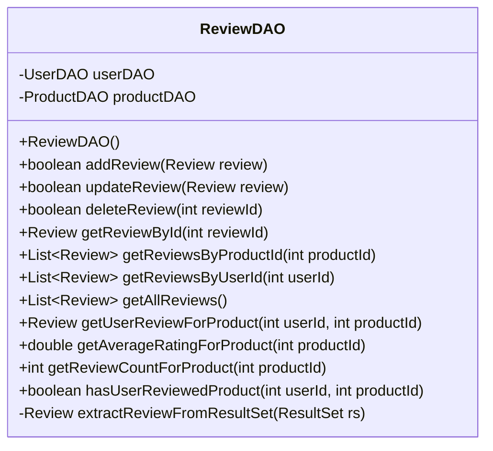

```mermaid
classDiagram
    class ReviewDAO {
        -UserDAO userDAO
        -ProductDAO productDAO
        
        +ReviewDAO()
        +boolean addReview(Review review)
        +boolean updateReview(Review review)
        +boolean deleteReview(int reviewId)
        +Review getReviewById(int reviewId)
        +List~Review~ getReviewsByProductId(int productId)
        +List~Review~ getReviewsByUserId(int userId)
        +List~Review~ getAllReviews()
        +Review getUserReviewForProduct(int userId, int productId)
        +double getAverageRatingForProduct(int productId)
        +int getReviewCountForProduct(int productId)
        +boolean hasUserReviewedProduct(int userId, int productId)
        -Review extractReviewFromResultSet(ResultSet rs)
    }
```
