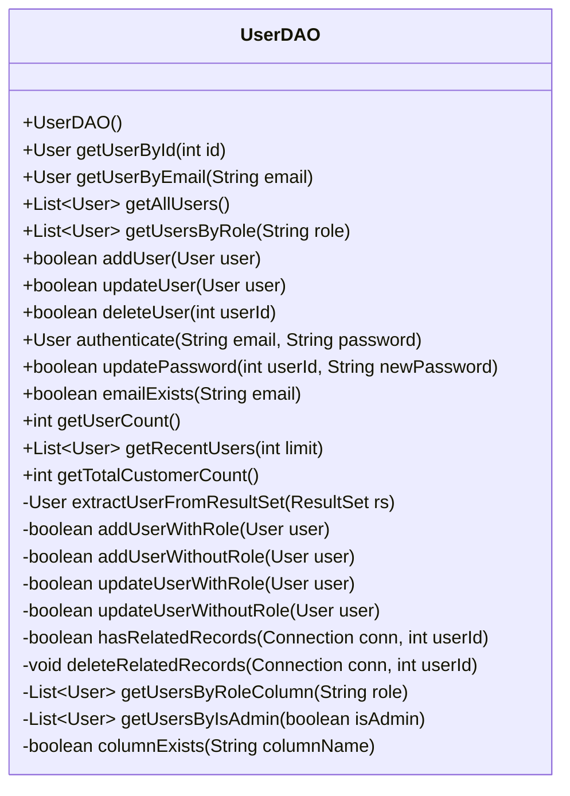

```mermaid
classDiagram
    class UserDAO {
        +UserDAO()
        +User getUserById(int id)
        +User getUserByEmail(String email)
        +List~User~ getAllUsers()
        +List~User~ getUsersByRole(String role)
        +boolean addUser(User user)
        +boolean updateUser(User user)
        +boolean deleteUser(int userId)
        +User authenticate(String email, String password)
        +boolean updatePassword(int userId, String newPassword)
        +boolean emailExists(String email)
        +int getUserCount()
        +List~User~ getRecentUsers(int limit)
        +int getTotalCustomerCount()
        -User extractUserFromResultSet(ResultSet rs)
        -boolean addUserWithRole(User user)
        -boolean addUserWithoutRole(User user)
        -boolean updateUserWithRole(User user)
        -boolean updateUserWithoutRole(User user)
        -boolean hasRelatedRecords(Connection conn, int userId)
        -void deleteRelatedRecords(Connection conn, int userId)
        -List~User~ getUsersByRoleColumn(String role)
        -List~User~ getUsersByIsAdmin(boolean isAdmin)
        -boolean columnExists(String columnName)
    }
```
