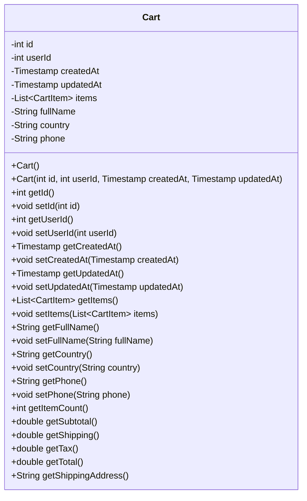

```mermaid
classDiagram
    class Cart {
        -int id
        -int userId
        -Timestamp createdAt
        -Timestamp updatedAt
        -List~CartItem~ items
        -String fullName

        -String country
        -String phone

        +Cart()
        +Cart(int id, int userId, Timestamp createdAt, Timestamp updatedAt)
        +int getId()
        +void setId(int id)
        +int getUserId()
        +void setUserId(int userId)
        +Timestamp getCreatedAt()
        +void setCreatedAt(Timestamp createdAt)
        +Timestamp getUpdatedAt()
        +void setUpdatedAt(Timestamp updatedAt)
        +List~CartItem~ getItems()
        +void setItems(List~CartItem~ items)
        +String getFullName()
        +void setFullName(String fullName)

        +String getCountry()
        +void setCountry(String country)
        +String getPhone()
        +void setPhone(String phone)
        +int getItemCount()
        +double getSubtotal()
        +double getShipping()
        +double getTax()
        +double getTotal()
        +String getShippingAddress()
    }
```
