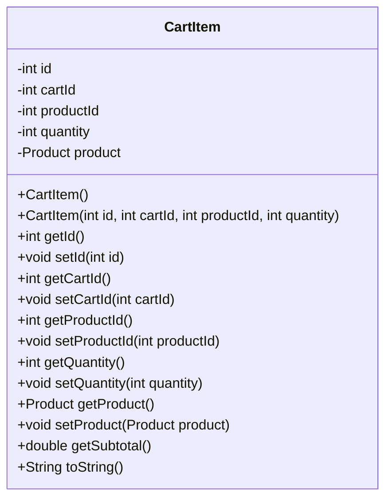

```mermaid
classDiagram
    class CartItem {
        -int id
        -int cartId
        -int productId
        -int quantity
        -Product product
        
        +CartItem()
        +CartItem(int id, int cartId, int productId, int quantity)
        +int getId()
        +void setId(int id)
        +int getCartId()
        +void setCartId(int cartId)
        +int getProductId()
        +void setProductId(int productId)
        +int getQuantity()
        +void setQuantity(int quantity)
        +Product getProduct()
        +void setProduct(Product product)
        +double getSubtotal()
        +String toString()
    }
```
