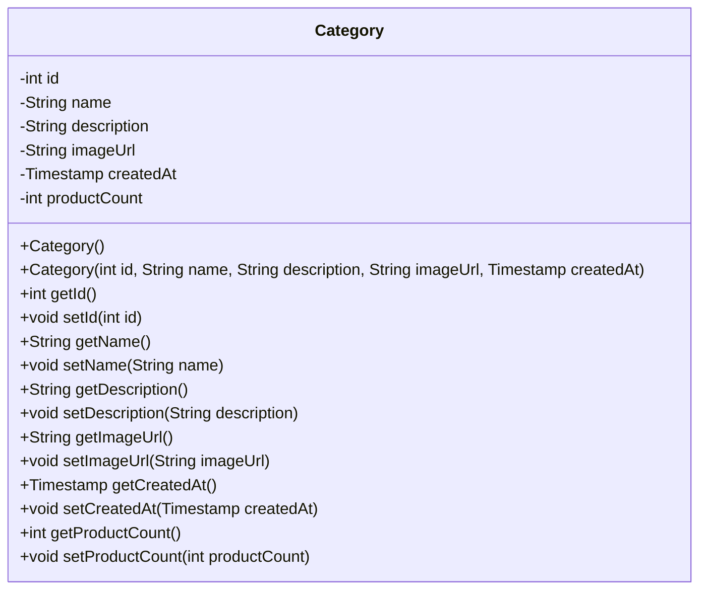

```mermaid
classDiagram
    class Category {
        -int id
        -String name
        -String description
        -String imageUrl
        -Timestamp createdAt
        -int productCount
        
        +Category()
        +Category(int id, String name, String description, String imageUrl, Timestamp createdAt)
        +int getId()
        +void setId(int id)
        +String getName()
        +void setName(String name)
        +String getDescription()
        +void setDescription(String description)
        +String getImageUrl()
        +void setImageUrl(String imageUrl)
        +Timestamp getCreatedAt()
        +void setCreatedAt(Timestamp createdAt)
        +int getProductCount()
        +void setProductCount(int productCount)
    }
```
