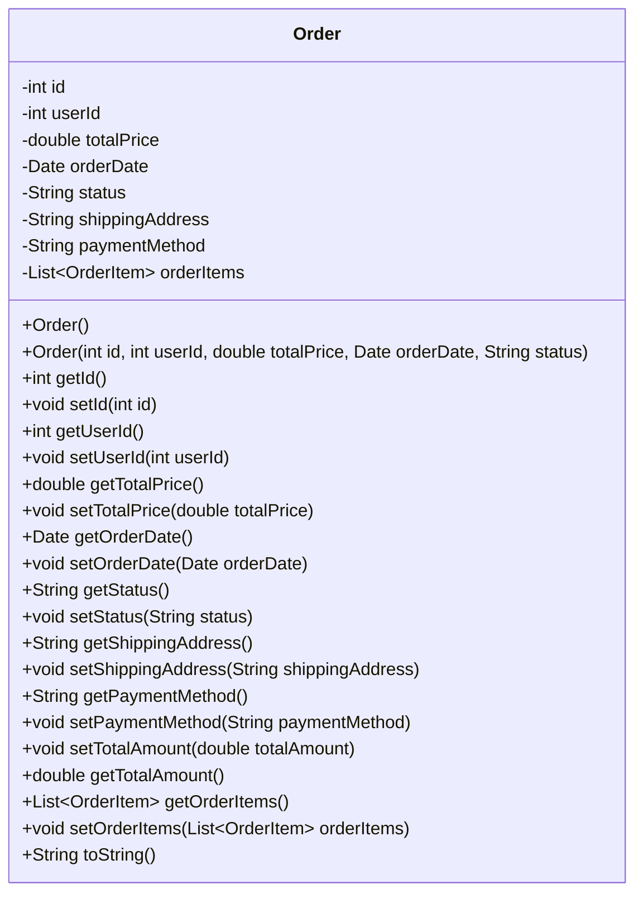

```mermaid
classDiagram
    class Order {
        -int id
        -int userId
        -double totalPrice
        -Date orderDate
        -String status
        -String shippingAddress
        -String paymentMethod
        -List~OrderItem~ orderItems
        
        +Order()
        +Order(int id, int userId, double totalPrice, Date orderDate, String status)
        +int getId()
        +void setId(int id)
        +int getUserId()
        +void setUserId(int userId)
        +double getTotalPrice()
        +void setTotalPrice(double totalPrice)
        +Date getOrderDate()
        +void setOrderDate(Date orderDate)
        +String getStatus()
        +void setStatus(String status)
        +String getShippingAddress()
        +void setShippingAddress(String shippingAddress)
        +String getPaymentMethod()
        +void setPaymentMethod(String paymentMethod)
        +void setTotalAmount(double totalAmount)
        +double getTotalAmount()
        +List~OrderItem~ getOrderItems()
        +void setOrderItems(List~OrderItem~ orderItems)
        +String toString()
    }
```
