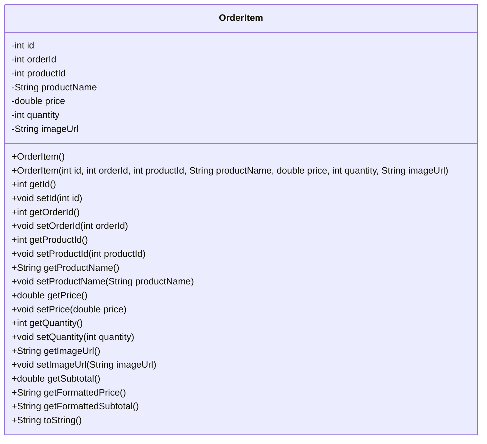

```mermaid
classDiagram
    class OrderItem {
        -int id
        -int orderId
        -int productId
        -String productName
        -double price
        -int quantity
        -String imageUrl
        
        +OrderItem()
        +OrderItem(int id, int orderId, int productId, String productName, double price, int quantity, String imageUrl)
        +int getId()
        +void setId(int id)
        +int getOrderId()
        +void setOrderId(int orderId)
        +int getProductId()
        +void setProductId(int productId)
        +String getProductName()
        +void setProductName(String productName)
        +double getPrice()
        +void setPrice(double price)
        +int getQuantity()
        +void setQuantity(int quantity)
        +String getImageUrl()
        +void setImageUrl(String imageUrl)
        +double getSubtotal()
        +String getFormattedPrice()
        +String getFormattedSubtotal()
        +String toString()
    }
```
