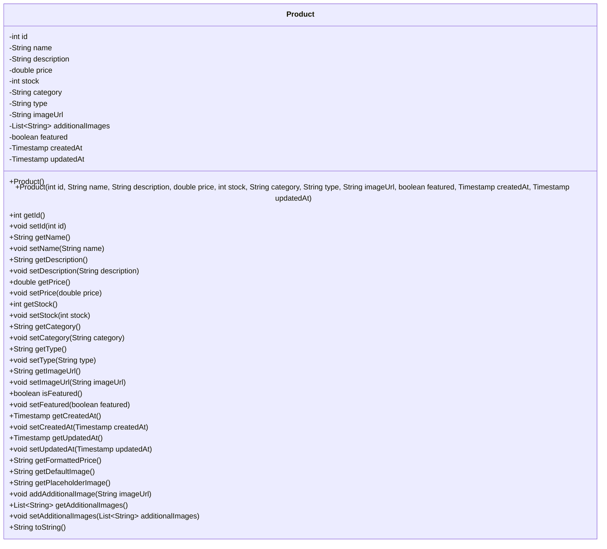

```mermaid
classDiagram
    class Product {
        -int id
        -String name
        -String description
        -double price
        -int stock
        -String category
        -String type
        -String imageUrl
        -List~String~ additionalImages
        -boolean featured
        -Timestamp createdAt
        -Timestamp updatedAt
        
        +Product()
        +Product(int id, String name, String description, double price, int stock, String category, String type, String imageUrl, boolean featured, Timestamp createdAt, Timestamp updatedAt)
        +int getId()
        +void setId(int id)
        +String getName()
        +void setName(String name)
        +String getDescription()
        +void setDescription(String description)
        +double getPrice()
        +void setPrice(double price)
        +int getStock()
        +void setStock(int stock)
        +String getCategory()
        +void setCategory(String category)
        +String getType()
        +void setType(String type)
        +String getImageUrl()
        +void setImageUrl(String imageUrl)
        +boolean isFeatured()
        +void setFeatured(boolean featured)
        +Timestamp getCreatedAt()
        +void setCreatedAt(Timestamp createdAt)
        +Timestamp getUpdatedAt()
        +void setUpdatedAt(Timestamp updatedAt)
        +String getFormattedPrice()
        +String getDefaultImage()
        +String getPlaceholderImage()
        +void addAdditionalImage(String imageUrl)
        +List~String~ getAdditionalImages()
        +void setAdditionalImages(List~String~ additionalImages)
        +String toString()
    }
```
