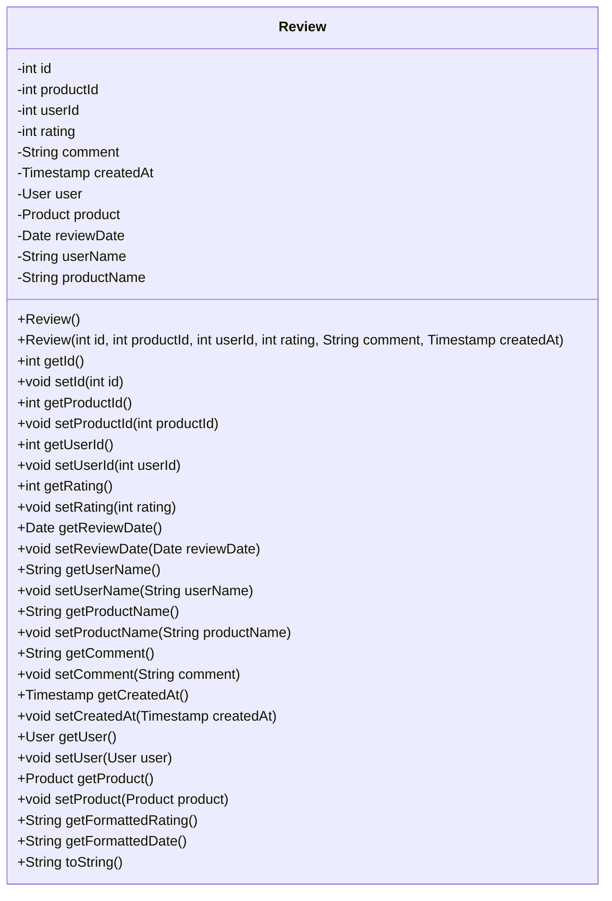

```mermaid
classDiagram
    class Review {
        -int id
        -int productId
        -int userId
        -int rating
        -String comment
        -Timestamp createdAt
        -User user
        -Product product
        -Date reviewDate
        -String userName
        -String productName
        
        +Review()
        +Review(int id, int productId, int userId, int rating, String comment, Timestamp createdAt)
        +int getId()
        +void setId(int id)
        +int getProductId()
        +void setProductId(int productId)
        +int getUserId()
        +void setUserId(int userId)
        +int getRating()
        +void setRating(int rating)
        +Date getReviewDate()
        +void setReviewDate(Date reviewDate)
        +String getUserName()
        +void setUserName(String userName)
        +String getProductName()
        +void setProductName(String productName)
        +String getComment()
        +void setComment(String comment)
        +Timestamp getCreatedAt()
        +void setCreatedAt(Timestamp createdAt)
        +User getUser()
        +void setUser(User user)
        +Product getProduct()
        +void setProduct(Product product)
        +String getFormattedRating()
        +String getFormattedDate()
        +String toString()
    }
```
