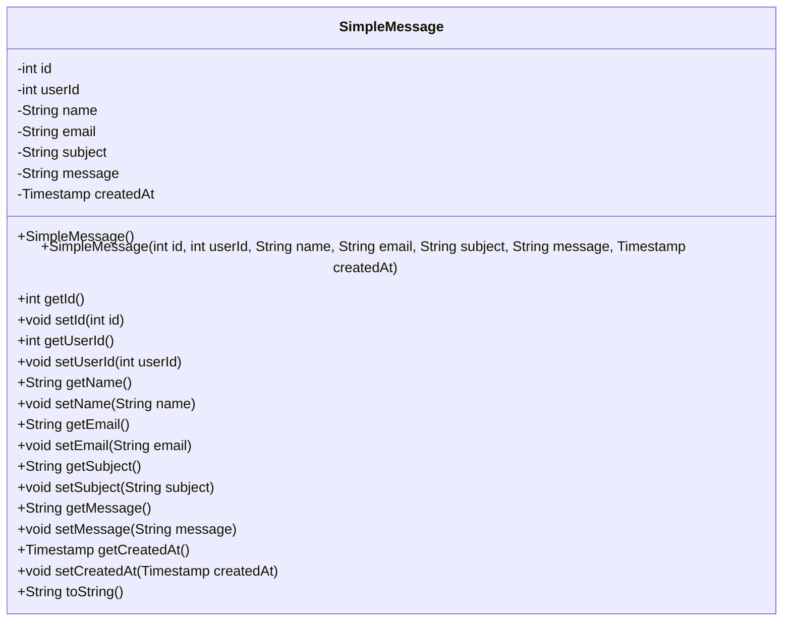

```mermaid
classDiagram
    class SimpleMessage {
        -int id
        -int userId
        -String name
        -String email
        -String subject
        -String message
        -Timestamp createdAt
        
        +SimpleMessage()
        +SimpleMessage(int id, int userId, String name, String email, String subject, String message, Timestamp createdAt)
        +int getId()
        +void setId(int id)
        +int getUserId()
        +void setUserId(int userId)
        +String getName()
        +void setName(String name)
        +String getEmail()
        +void setEmail(String email)
        +String getSubject()
        +void setSubject(String subject)
        +String getMessage()
        +void setMessage(String message)
        +Timestamp getCreatedAt()
        +void setCreatedAt(Timestamp createdAt)
        +String toString()
    }
```
