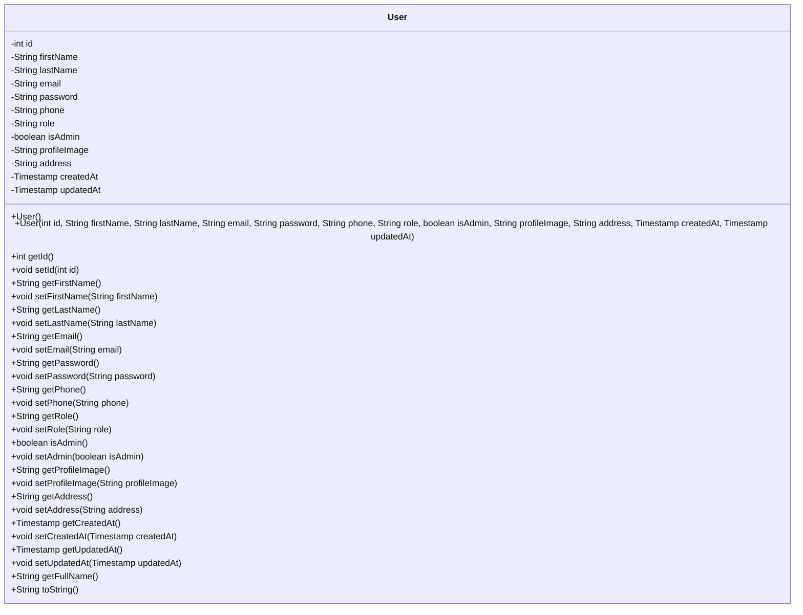

```mermaid
classDiagram
    class User {
        -int id
        -String firstName
        -String lastName
        -String email
        -String password
        -String phone
        -String role
        -boolean isAdmin
        -String profileImage
        -String address
        -Timestamp createdAt
        -Timestamp updatedAt
        
        +User()
        +User(int id, String firstName, String lastName, String email, String password, String phone, String role, boolean isAdmin, String profileImage, String address, Timestamp createdAt, Timestamp updatedAt)
        +int getId()
        +void setId(int id)
        +String getFirstName()
        +void setFirstName(String firstName)
        +String getLastName()
        +void setLastName(String lastName)
        +String getEmail()
        +void setEmail(String email)
        +String getPassword()
        +void setPassword(String password)
        +String getPhone()
        +void setPhone(String phone)
        +String getRole()
        +void setRole(String role)
        +boolean isAdmin()
        +void setAdmin(boolean isAdmin)
        +String getProfileImage()
        +void setProfileImage(String profileImage)
        +String getAddress()
        +void setAddress(String address)
        +Timestamp getCreatedAt()
        +void setCreatedAt(Timestamp createdAt)
        +Timestamp getUpdatedAt()
        +void setUpdatedAt(Timestamp updatedAt)
        +String getFullName()
        +String toString()
    }
```
