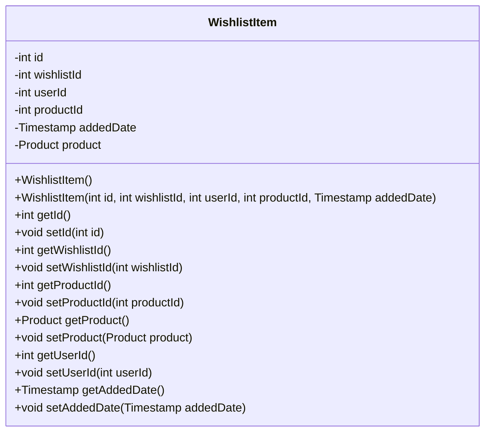

```mermaid
classDiagram
    class WishlistItem {
        -int id
        -int wishlistId
        -int userId
        -int productId
        -Timestamp addedDate
        -Product product
        
        +WishlistItem()
        +WishlistItem(int id, int wishlistId, int userId, int productId, Timestamp addedDate)
        +int getId()
        +void setId(int id)
        +int getWishlistId()
        +void setWishlistId(int wishlistId)
        +int getProductId()
        +void setProductId(int productId)
        +Product getProduct()
        +void setProduct(Product product)
        +int getUserId()
        +void setUserId(int userId)
        +Timestamp getAddedDate()
        +void setAddedDate(Timestamp addedDate)
    }
```
