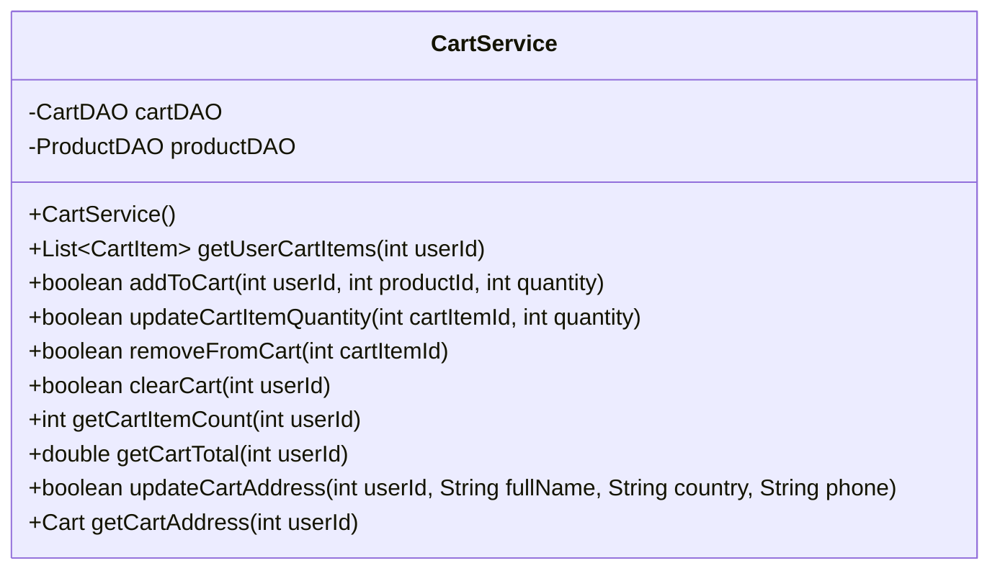

```mermaid
classDiagram
    class CartService {
        -CartDAO cartDAO
        -ProductDAO productDAO

        +CartService()
        +List~CartItem~ getUserCartItems(int userId)
        +boolean addToCart(int userId, int productId, int quantity)
        +boolean updateCartItemQuantity(int cartItemId, int quantity)
        +boolean removeFromCart(int cartItemId)
        +boolean clearCart(int userId)
        +int getCartItemCount(int userId)
        +double getCartTotal(int userId)
        +boolean updateCartAddress(int userId, String fullName, String country, String phone)
        +Cart getCartAddress(int userId)
    }
```
