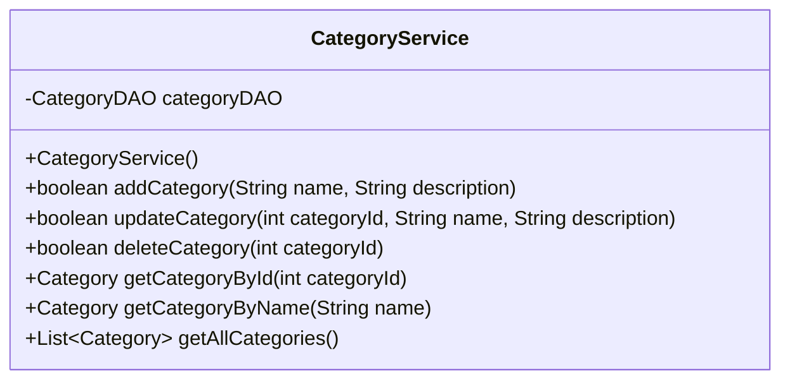

```mermaid
classDiagram
    class CategoryService {
        -CategoryDAO categoryDAO
        
        +CategoryService()
        +boolean addCategory(String name, String description)
        +boolean updateCategory(int categoryId, String name, String description)
        +boolean deleteCategory(int categoryId)
        +Category getCategoryById(int categoryId)
        +Category getCategoryByName(String name)
        +List~Category~ getAllCategories()
    }
```
