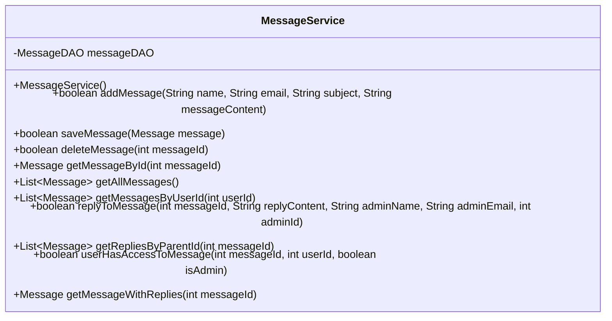

```mermaid
classDiagram
    class MessageService {
        -MessageDAO messageDAO
        
        +MessageService()
        +boolean addMessage(String name, String email, String subject, String messageContent)
        +boolean saveMessage(Message message)
        +boolean deleteMessage(int messageId)
        +Message getMessageById(int messageId)
        +List~Message~ getAllMessages()
        +List~Message~ getMessagesByUserId(int userId)
        +boolean replyToMessage(int messageId, String replyContent, String adminName, String adminEmail, int adminId)
        +List~Message~ getRepliesByParentId(int messageId)
        +boolean userHasAccessToMessage(int messageId, int userId, boolean isAdmin)
        +Message getMessageWithReplies(int messageId)
    }
```
