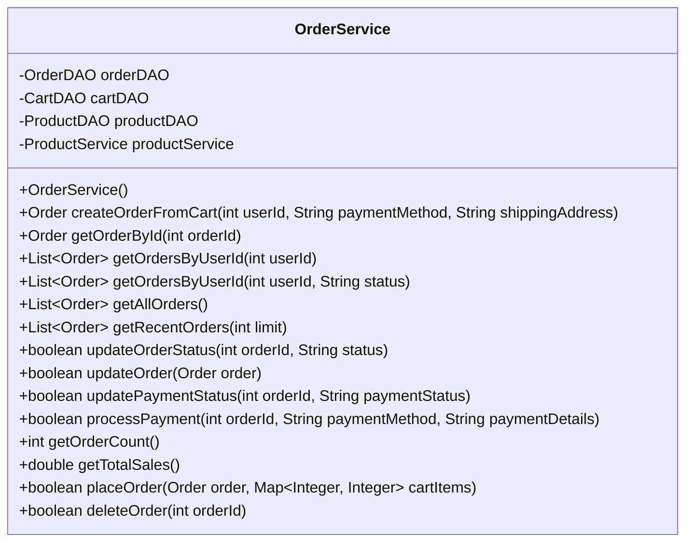

```mermaid
classDiagram
    class OrderService {
        -OrderDAO orderDAO
        -CartDAO cartDAO
        -ProductDAO productDAO
        -ProductService productService
        
        +OrderService()
        +Order createOrderFromCart(int userId, String paymentMethod, String shippingAddress)
        +Order getOrderById(int orderId)
        +List~Order~ getOrdersByUserId(int userId)
        +List~Order~ getOrdersByUserId(int userId, String status)
        +List~Order~ getAllOrders()
        +List~Order~ getRecentOrders(int limit)
        +boolean updateOrderStatus(int orderId, String status)
        +boolean updateOrder(Order order)
        +boolean updatePaymentStatus(int orderId, String paymentStatus)
        +boolean processPayment(int orderId, String paymentMethod, String paymentDetails)
        +int getOrderCount()
        +double getTotalSales()
        +boolean placeOrder(Order order, Map~Integer, Integer~ cartItems)
        +boolean deleteOrder(int orderId)
    }
```
