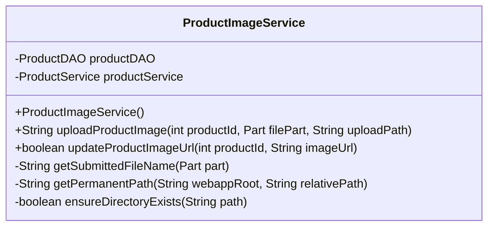

```mermaid
classDiagram
    class ProductImageService {
        -ProductDAO productDAO
        -ProductService productService
        
        +ProductImageService()
        +String uploadProductImage(int productId, Part filePart, String uploadPath)
        +boolean updateProductImageUrl(int productId, String imageUrl)
        -String getSubmittedFileName(Part part)
        -String getPermanentPath(String webappRoot, String relativePath)
        -boolean ensureDirectoryExists(String path)
    }
```
