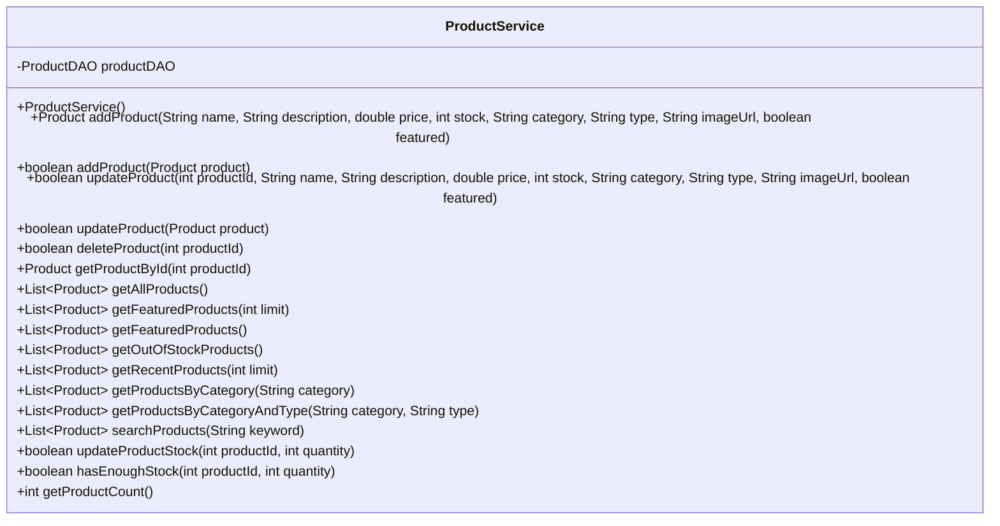

```mermaid
classDiagram
    class ProductService {
        -ProductDAO productDAO
        
        +ProductService()
        +Product addProduct(String name, String description, double price, int stock, String category, String type, String imageUrl, boolean featured)
        +boolean addProduct(Product product)
        +boolean updateProduct(int productId, String name, String description, double price, int stock, String category, String type, String imageUrl, boolean featured)
        +boolean updateProduct(Product product)
        +boolean deleteProduct(int productId)
        +Product getProductById(int productId)
        +List~Product~ getAllProducts()
        +List~Product~ getFeaturedProducts(int limit)
        +List~Product~ getFeaturedProducts()
        +List~Product~ getOutOfStockProducts()
        +List~Product~ getRecentProducts(int limit)
        +List~Product~ getProductsByCategory(String category)
        +List~Product~ getProductsByCategoryAndType(String category, String type)
        +List~Product~ searchProducts(String keyword)
        +boolean updateProductStock(int productId, int quantity)
        +boolean hasEnoughStock(int productId, int quantity)
        +int getProductCount()
    }
```
