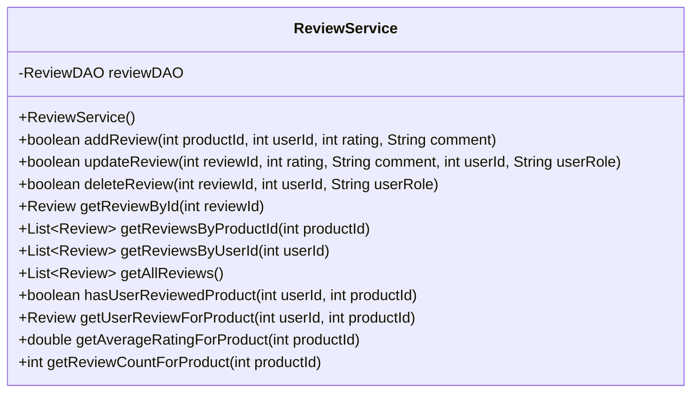

```mermaid
classDiagram
    class ReviewService {
        -ReviewDAO reviewDAO
        
        +ReviewService()
        +boolean addReview(int productId, int userId, int rating, String comment)
        +boolean updateReview(int reviewId, int rating, String comment, int userId, String userRole)
        +boolean deleteReview(int reviewId, int userId, String userRole)
        +Review getReviewById(int reviewId)
        +List~Review~ getReviewsByProductId(int productId)
        +List~Review~ getReviewsByUserId(int userId)
        +List~Review~ getAllReviews()
        +boolean hasUserReviewedProduct(int userId, int productId)
        +Review getUserReviewForProduct(int userId, int productId)
        +double getAverageRatingForProduct(int productId)
        +int getReviewCountForProduct(int productId)
    }
```
