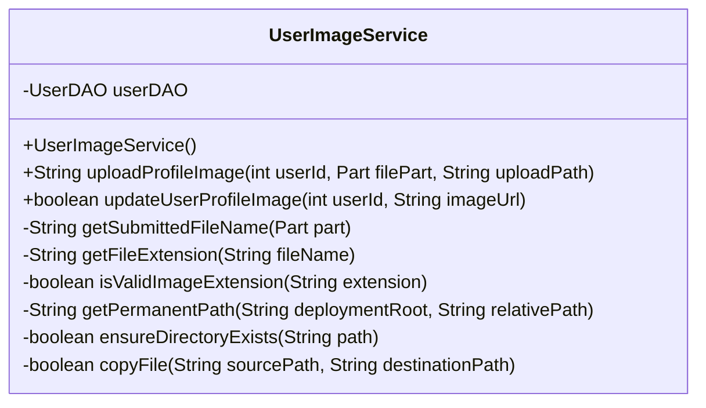

```mermaid
classDiagram
    class UserImageService {
        -UserDAO userDAO
        
        +UserImageService()
        +String uploadProfileImage(int userId, Part filePart, String uploadPath)
        +boolean updateUserProfileImage(int userId, String imageUrl)
        -String getSubmittedFileName(Part part)
        -String getFileExtension(String fileName)
        -boolean isValidImageExtension(String extension)
        -String getPermanentPath(String deploymentRoot, String relativePath)
        -boolean ensureDirectoryExists(String path)
        -boolean copyFile(String sourcePath, String destinationPath)
    }
```
