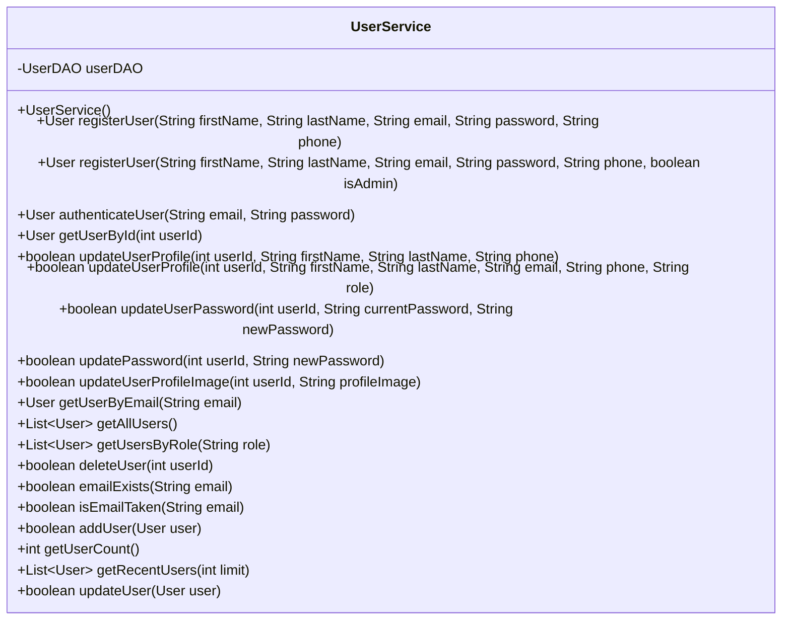

```mermaid
classDiagram
    class UserService {
        -UserDAO userDAO
        
        +UserService()
        +User registerUser(String firstName, String lastName, String email, String password, String phone)
        +User registerUser(String firstName, String lastName, String email, String password, String phone, boolean isAdmin)
        +User authenticateUser(String email, String password)
        +User getUserById(int userId)
        +boolean updateUserProfile(int userId, String firstName, String lastName, String phone)
        +boolean updateUserProfile(int userId, String firstName, String lastName, String email, String phone, String role)
        +boolean updateUserPassword(int userId, String currentPassword, String newPassword)
        +boolean updatePassword(int userId, String newPassword)
        +boolean updateUserProfileImage(int userId, String profileImage)
        +User getUserByEmail(String email)
        +List~User~ getAllUsers()
        +List~User~ getUsersByRole(String role)
        +boolean deleteUser(int userId)
        +boolean emailExists(String email)
        +boolean isEmailTaken(String email)
        +boolean addUser(User user)
        +int getUserCount()
        +List~User~ getRecentUsers(int limit)
        +boolean updateUser(User user)
    }
```
